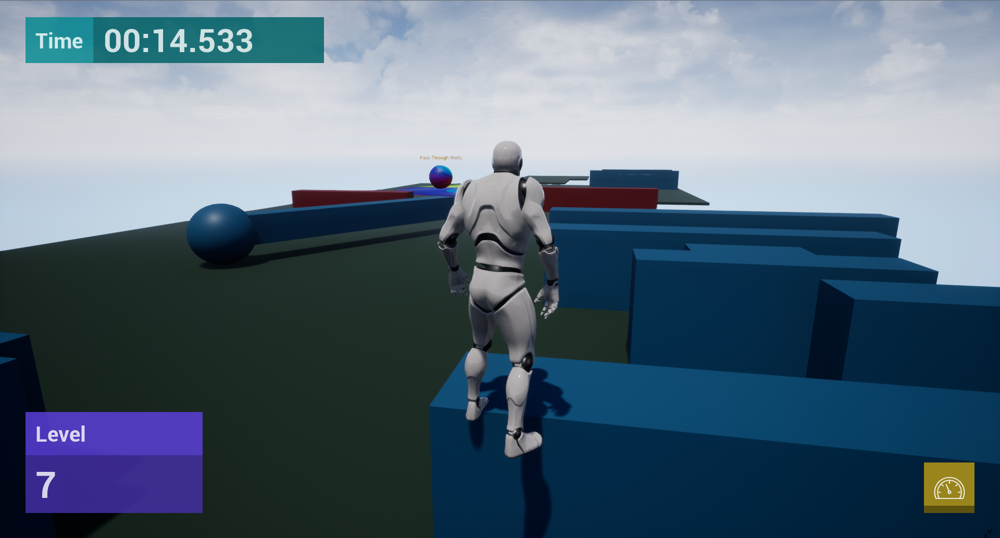

## Garifullin Ruslan БПИ191

#### Home Assignment 1

This game is a third-person view 3D platform game with levels which are generated procedurally.

The game allows the player to walk around the procedurally generated platforms with obstacles, as well as jump between those platforms and collect bonuses, which affect the gameplay.

The game has 10 levels, difficulty increases gradually. Falling from a platform or touching an insta-kill object results in the level being reset.

The distance to the finish line is tied to player's Level: `1000 * (Level + 1)` (game units)

The platform's length is randomly selected: 1000, 2000, 3000 or 4000 game units

Spawned random platforms are divided into slots 1000x1000 game units each, which are then filled with random obstacles

**Obstacles:**
 - Gap between platforms, width of which depends on the player's Level: `500 + Level * 10` (game units)
 - Walls (1000x1000) are randomly placed on the space, number of walls is determined by player's Level: `Random(1, Level)`
 - Insta-kill objects are represented by a set (3000x1000) of two moving in ping-pong movement blocks, movement speed is tied to the player's Level: `500 + Level * 75` (game units per second)
 - Spinning platforms' (2000x2000) rotation speed are tied to the player's Level as well: `55 + Level * 10` (degrees per second)
 - Knocking-off moving objects are represented by a rotating log (2000x2000), rotation speed is tied to the player's Level: `60 + Level * 9` (degrees per second)

**Bonuses:**
 - Movement slowdown, decreases all moving objects' movement speeds by 70% for 10 seconds
 - Wall passthrough, removes all walls' (and rotating logs') collision for 5 seconds

The game uses the default ThirdPersonCharacter blueprint.
